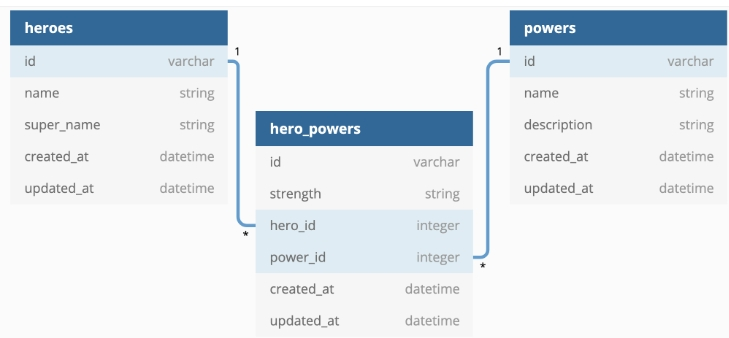

# Superheroes
#### A Ruby on Rails API

##### Owner
API by Elizabeth Mwende Muthusi
##### Date
25/03/2023.

### About
This Ruby on Rails API provides endpoints for managing three models: Hero, Power, and HeroPower.

### Models relationship
The relationships between the models are as follows:

- A Hero has many HeroPowers and has many Powers through HeroPowers.
- A Power has many HeroPowers and has many Heroes through HeroPowers.
- A HeroPower belongs to one Hero and belongs to one Power.

In other words, a Hero can have multiple powers, and a Power can be possessed by multiple heroes. The HeroPower model acts as a join table between the Hero and Power models, storing additional information about the strength of the power possessed by the hero.

The relationship between the models can be visualized as follows:

### Hero Model
##### Attributes
- name: string, required. The name of the hero.
- super_name: string, required. The superhero name of the hero.
- created_at: Timestamp when the Hero was created (datetime)
- updated_at: Timestamp when the Hero was last updated (datetime)

##### Endpoints
The following endpoints are available for the Hero model:

- GET `/heroes`: Returns a list of all heroes.
- GET `/heroes/:id`: Returns details of a specific hero with their powers.

### Power Model
##### Attributes
- name: string, required. The name of the power.
- description: string, required. The description of the power, not less than 20 characters long.
- created_at: Timestamp when the Power was created (datetime)
- updated_at: Timestamp when the Power was last updated (datetime)

##### Endpoints
The following endpoints are available for the Power model:

- GET `/powers`: Returns a list of all powers.
- GET `/powers/:id`: Returns details of a specific power.
- PATCH `/powers/:id`: Updates the details of a specific power.

### HeroPower Model
##### Attributes
- strength: string, required. The strength of the hero power, only in three values, Strong, Weak and Average.
- hero_id: integer, required. The ID of the hero.
- power_id: integer, required. The ID of the power.
- created_at: Timestamp when the HeroPower was created (datetime)
- updated_at: Timestamp when the HeroPower was last updated (datetime)

##### Endpoints
The following endpoint is available for the HeroPower model:

- POST `/hero_powers`: Creates a new hero power and returns the hero with his/her powers.

#### Getting Started
To get started with this API, you need to follow the steps mentioned below and run on the command line:

1. Clone this repository on your local machine
2. Install the required dependencies by running `bundle install`
3. Run the database migrations and seed the database using `rails db:migrate db:seed`
4. Start the server using `rails server`

You can test and use the endpoints for each model defined above by using `http://localhost:3000` and add the endpoints. You can use it in your project or use a program like Postman.

#### Conclusion
This API provides basic functionality for managing heroes, powers, and hero powers. You can use this API as a starting point for building more complex applications that involve superheroes and their powers